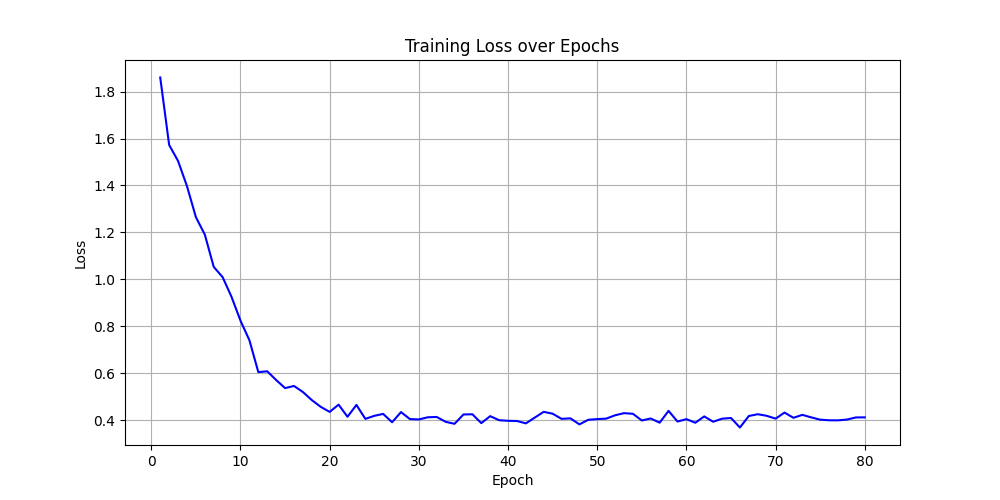
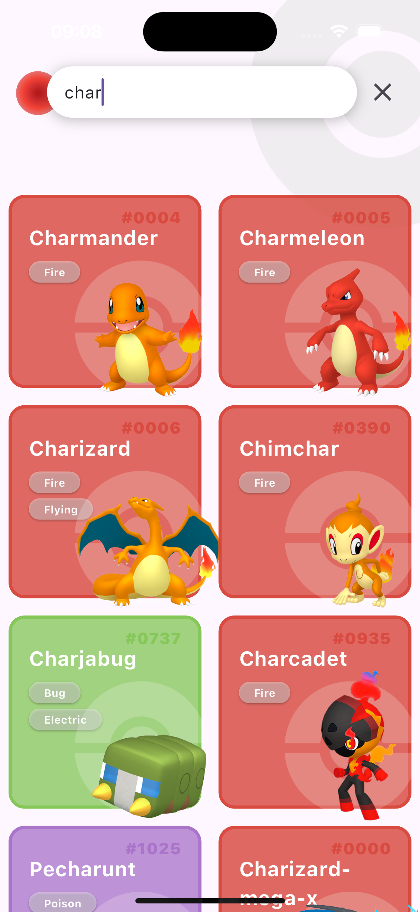
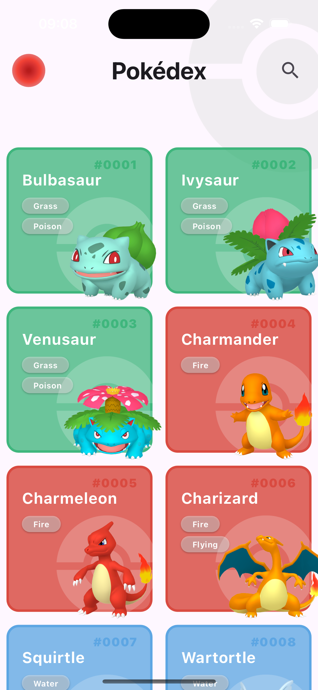

# Pokedex Project

This project is a Pokedex application with a Flutter frontend, a Django backend, and a PyTorch model for Pokemon classification. The application allows users to classify images of Pokemon and retrieve detailed information about them.

## Table of Contents
- [Overview](#overview)
- [Features](#features)
- [Setup](#setup)
- [Usage](#usage)
- [Acknowledgements](#acknowledgements)
- [Assets](#assets)

## Overview

The Pokedex project consists of three main components:
1. **Frontend**: Built with Flutter, providing a user-friendly interface for searching and displaying Pokemon information.
2. **Backend****: Implemented with Django, handling API requests and serving the model predictions.
3. **Model**: A PyTorch model trained to classify images of Pokemon.

Currently, the model is trained to recognize the following Pokemon:
- Blastoise
- Butterfree
- Charizard
- Dragonite
- Gengar
- Gyarados
- Pikachu
- Rhyhorn
- Slowbro
- Venusaur

## Features

- Search for Pokemon by name.
- Classify images of Pokemon using the trained model.
- Retrieve detailed information about each Pokemon from the OpenPokeApi.

## Setup

### Prerequisites

- Python 3.8+
- Node.js
- Flutter SDK
- Dart SDK

### Backend Setup

1. Navigate to the backend directory:
    ```sh
    cd backend/pokedex_model_api
    ```

2. Install the required Python packages:
    ```sh
    pip install -r requirements.txt
    ```

3. Apply the database migrations:
    ```sh
    python manage.py migrate
    ```

4. Start the Django development server:
    ```sh
    python manage.py runserver
    ```

### Frontend Setup

1. Navigate to the frontend directory:
    ```sh
    cd frontend
    ```

2. Install the required Dart packages:
    ```sh
    flutter pub get
    ```

3. Run the Flutter application:
    ```sh
    flutter run
    ```

## Usage

1. Start the backend server first by following the Backend Setup instructions.
2. Open the Flutter application on your device or emulator by following the Frontend Setup instructions.
3. Use the search functionality to find Pokemon by name.
4. Upload an image of a Pokemon to classify it using the trained model.

## Acknowledgements

- This project uses data from the [OpenPokeApi](https://pokeapi.co/).
- Special thanks to the contributors of the OpenPokeApi for providing a comprehensive Pokemon database.

## Assets

The project includes various assets such as images and videos to enhance the user experience in the Flutter application.

### Model Training


### Classification Feature
<video width="320" height="240" controls>
  <source src="assets/demo_classification_feature.mp4" type="video/mp4">
  Your browser does not support the video tag.
</video>

### Search Feature


### User Interface
